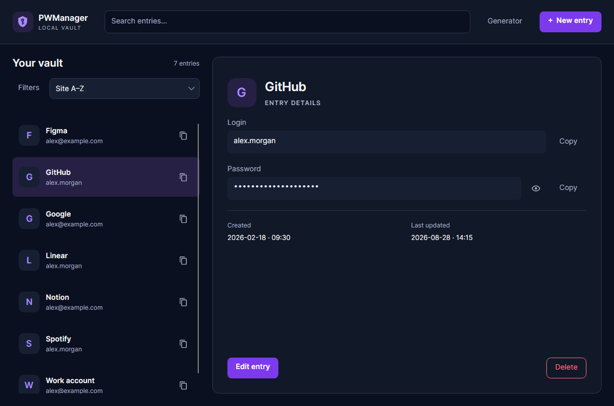
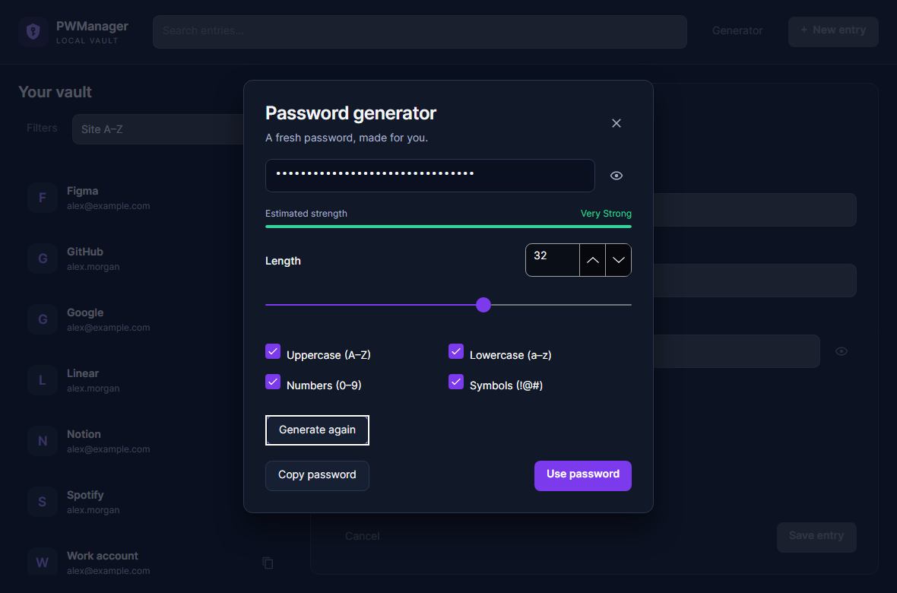
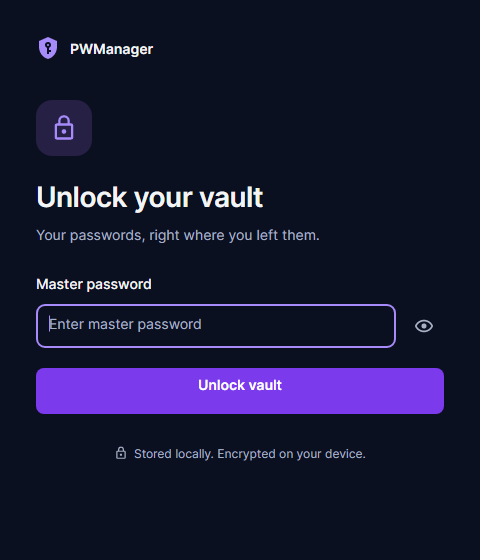

# PWManager

A personal desktop password manager built with .NET 10 and Avalonia UI. Keep credentials in a local SQLite database and find, copy, or update them through a focused dark interface.



## Features

- Dark navy and violet theme, with readable text, visible keyboard focus, and labeled actions.
- Search across site and login, plus optional site/login filters.
- Sort by site, login, creation date, or last update, in either direction.
- Virtualized entry list with quick password copy and a separate details pane.
- Create and edit entries in a draft; changes are saved only when you choose Save.
- Field validation, explicit deletion confirmation, and a prompt before discarding unsaved changes.
- Copy login or password without revealing it; show/hide controls reset when changing context.
- Password generator with a length slider and numeric input, uppercase/lowercase, numbers, symbols, and an estimated strength indicator.
- Loading, empty-vault, no-results, and retry states, with consistent success and error messages.
- Responsive layout: list and details side by side at widths of 1000 logical pixels or more; a single pane with **Back to entries** below that.
- AES-256 encryption of credential fields before local persistence, using the existing PBKDF2 derivation and storage format.

The redesign does not migrate the database or change the encryption format.

## Using the vault

Enter your master password on **Unlock your vault**. For an empty vault, the application retains its existing behavior: the entered password is used to encrypt the entries you subsequently save.

Search in the header, then select an entry to see its login, password, creation date, and last update. The copy icon in a list row copies its password directly. In the details pane, **Copy** is available beside both login and password.

**Filters** expands the separate site and login fields. Global search matches site **or** login; the specific filters are combined with it using **and**. Matching is case-insensitive. **Clear filters** also clears global search.

Choose **New entry** to create a credential, or **Edit entry** from its details. Site accepts either a domain or a descriptive name. Password content, including leading or trailing spaces, is preserved. Failed saves keep the draft available for another attempt. If an entry disappears during editing, **Save as new entry** lets you preserve the draft as a new record.

After saving, the saved entry remains selected. If filters hide it from the list, a message and **Clear filters** action explain how to show it again. **Cancel**, navigation away from an altered draft, and window closing prompt before discarding changes. **Delete** requires a separate confirmation.

### Password generator



Open **Generator** in the header for standalone use, or **Generate a password** in the editor.

- Length ranges from 8 to 48 characters; the default is 20.
- Changing length or character options generates a fresh password. **Generate again** regenerates manually.
- If all character options are off, lowercase letters are used and the dialog explains the fallback.
- **Copy password** copies the result.
- **Use password**, when opened from the editor, fills the current draft.
- **Use in new entry**, when opened from the header, starts a new draft and prompts before replacing unsaved work.

The strength indicator is an estimate based on the existing length/options scoring, not a guarantee about a generated password. The existing generator selects characters from the enabled pool; it does not guarantee every enabled category appears in every result.

### Keyboard shortcuts

| Shortcut | Action |
|---|---|
| Ctrl+F | Focus and select the search text |
| Ctrl+N | Start a new entry |
| Ctrl+S | Save the current editor |
| Esc | Close the generator, cancel a confirmation, or leave the current editor/pane |
| Enter | Unlock from the master password field |
| Tab / Shift+Tab | Move between controls; focus stays within an open dialog |
| Arrow keys | Navigate the entry list |

Success notifications disappear after three seconds. Errors remain until corrected, retried, or dismissed. Passwords return to their masked state when the relevant context changes.

## Requirements

- **Development:** .NET 10 SDK.
- **Framework-dependent execution:** .NET 10 Runtime and the native dependencies required by Avalonia on your OS.
- **Published Windows release:** the self-contained win-x64 package includes the runtime; a separate .NET installation is unnecessary.
- Windows is the build/test target used by the included workflows. Avalonia also supports other desktop platforms, whose native window and clipboard integration should be verified on the target OS.

## Build and run

From the repository root:

```powershell
dotnet restore PWManager.sln
dotnet build PWManager.sln -c Debug --no-restore
dotnet build PWManager.sln -c Release --no-restore
dotnet run --project src/PWManager/PWManager.csproj -c Release --no-build
```

To execute the compiled assembly directly:

```powershell
dotnet src/PWManager/bin/Release/net10.0/PWManager.dll
```

To produce a self-contained Windows package locally:

```powershell
dotnet publish src/PWManager/PWManager.csproj -c Release -r win-x64 --self-contained true -p:PublishSingleFile=true -p:IncludeNativeLibrariesForSelfExtract=true -o publish
```

Run `publish/PWManager.exe` and keep the generated `appsettings.json` alongside it.

## Tests

```powershell
dotnet test PWManager.sln -c Release --no-build --no-restore
```

Build the Release solution first. The solution contains:

- **PWManager.UnitTests:** xUnit 2 application tests, generator and vault service tests, ViewModel/interaction tests, fake-time notification tests, and a temporary SQLite persistence cycle.
- **PWManager.UITests:** xUnit 3 with Avalonia.Headless.XUnit 12.0.2. Exercises production views and styles with fake credentials and services, including compiled bindings, copy actions, keyboard focus, dialogs, responsive layout, virtualization with 1000 entries, and 100%/150%/200% rendering scales.

The UI test application skips production startup, so it never opens the personal vault. Persistence tests create an isolated temporary SQLite database and remove it afterward. Tests do not use the system clipboard.

To regenerate screenshots from the actual Avalonia controls with sample data:

```powershell
$env:PWMANAGER_SCREENSHOTS = "$PWD/artifacts/screenshots"
dotnet test src/PWManager.UITests/PWManager.UITests.csproj -c Release --no-build --no-restore
Remove-Item Env:PWMANAGER_SCREENSHOTS
```

The images in this README are headless renders of the production Avalonia views using fictitious entries. Native title bars are supplied by the OS and are not included in these renders.

Pull requests run restore, Debug/Release builds, and all tests. The existing main-branch release workflow builds and tests the entire solution before packaging.

### Existing build notices

The redesign removes the deprecated Avalonia properties from the active views. The solution still reports pre-existing nullable-reference and cryptographic-API warnings, and the NuGet `NU1903` advisory for the transitive `SQLitePCLRaw.lib.e_sqlite3` dependency. Those warnings have not been suppressed or represented as fixed by the UI work.

## Storage and security behavior

- By default, the database is `%AppData%\PWManager\pwmanager.db` on Windows. Other platforms use .NET's application-data location.
- `DatabaseConfig.AppFolder` and `DatabaseConfig.DbFile` in `appsettings.json` control the location.
- Site, login, and password fields are encrypted before they are written. This does **not** mean the entire SQLite file is encrypted; IDs and timestamps remain database metadata.
- The application uses AES-256 and the existing PBKDF2 key derivation.
- Credentials are decrypted and held in memory during an unlocked session to support searching and use. Masking controls their visual display.
- The master password is not persisted by the application; the existing encryption service retains it in memory for the unlocked session.
- Copy actions place the selected content on the OS clipboard. This version does not automatically clear it.
- The application does not synchronize or transmit vault entries to a remote service.

## Architecture

| Project | Responsibility |
|---|---|
| PWManager.Domain | Entities and repository/encryption contracts |
| PWManager.Application | Application use cases |
| PWManager.Infra | SQLite/EF Core persistence and encryption |
| PWManager | Avalonia views, ViewModels, styles, and desktop services |
| PWManager.UnitTests | Application, ViewModel, interaction, and persistence tests |
| PWManager.UITests | Headless UI and rendering tests |

The UI uses CommunityToolkit.Mvvm, compiled bindings, Inter, FluentTheme, and Material Icons. ViewModels coordinate screen state, navigation requests, filters, and editor validation. Editor drafts are separate from loaded entries.

`VaultEntryService` handles loading and saving credential copies, encryption coordination, and timestamps. `PasswordGenerator` contains the character generation algorithm. Clipboard, vault entry, unlock, and navigation services are injected; notification and persistence timing use `TimeProvider`. UI service interfaces live in `Services/Interfaces`, and enums live in `Enums`, each in its own file.

The root `.editorconfig` defines indentation, braces, and line breaks. Run `dotnet format whitespace PWManager.sln --no-restore` after restoring dependencies to apply the formatting rules.

## Theme

| Role | Color |
|---|---|
| Canvas | `#0B1020` |
| Surface | `#111827` |
| Raised surface | `#172033` |
| Separator | `#2B3750` |
| Primary text | `#F3F4F6` |
| Secondary text | `#A7B0C4` |
| Primary action | `#7C3AED` |
| Focus/accent text | `#A78BFA` |
| Success | `#34D399` |
| Error/destructive action | `#FB7185` |

Colors and control styles are shared resources. Text contrast targets at least 4.5:1 for normal text. This release provides an English dark interface.


